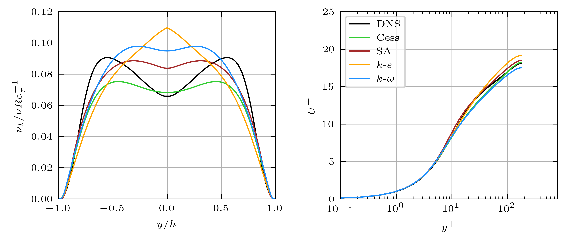
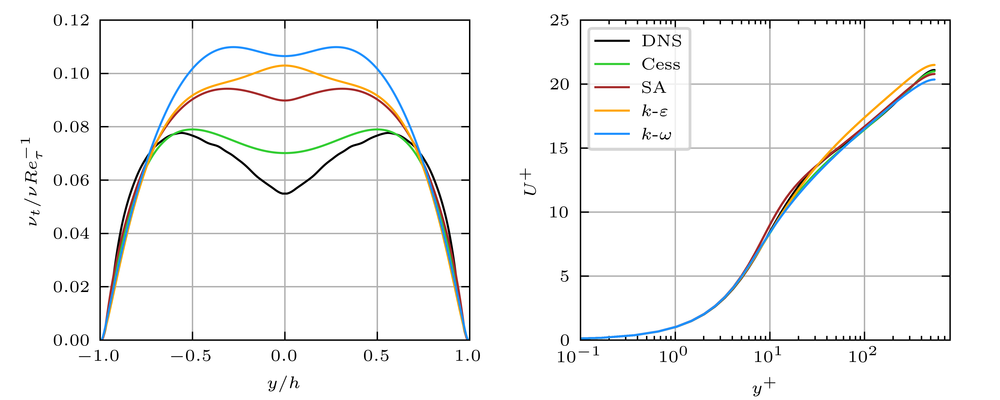

# RANS-ChannelFlow
This code solves the 1D RANS equation of turbulent channel flow.
Mesh is the Chebyshev points.
Turbulence models include:
- [ ] Cess eddy viscosity
- [ ] mixing length
- [ ] Spalart-Allmaras
- [ ] standard k-epsilon
- [ ] Chien k-epsilon
- [ ] standard k-omega
## The results of $Re_\tau=180,550$ are presented

